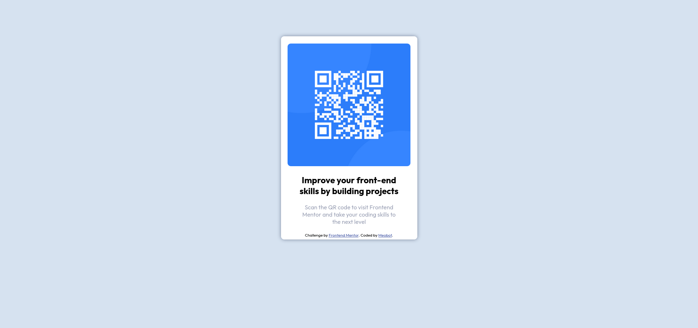

# Frontend Mentor - QR code component solution

This is a solution to the [QR code component challenge on Frontend Mentor](https://www.frontendmentor.io/challenges/qr-code-component-iux_sIO_H). Frontend Mentor challenges help you improve your coding skills by building realistic projects. 

## Table of contents

- [Overview](#overview)
  - [Screenshot](#screenshot)
  - [Links](#links)
- [My process](#my-process)
  - [Built with](#built-with)
- [Author](#author)

## Overview
QR code project
### Screenshot

### Links

- Solution URL: [Add solution URL here](https://your-solution-url.com)
- Live Site URL: [Add live site URL here](https://your-live-site-url.com)

## My process
I first built the HTML elements such as the div's and then formatted all of the text how I liked it. Then I worked on the CSS, which took some trial and error, but it came out to my liking in the end.

### Built with
- VSCode
- Semantic HTML5 markup
- CSS custom properties
- Flexbox
- Mobile-first workflow
## Author

- Website - [Nathan Rhodes](https://github.com/Meobot)
- Frontend Mentor - [@Meobot](https://www.frontendmentor.io/profile/Meobot)
- Twitter - [@Nrhodes723](https://www.twitter.com/Nrhodes723)
